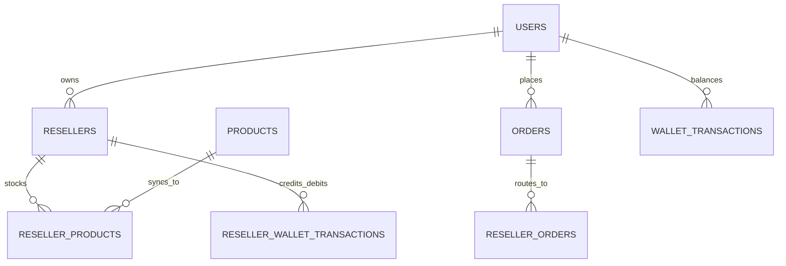

# Swapnobaz – Database Schema & Collection Architecture

This document details the MongoDB data structures, collection models, logical tenancy partitions, and relations implemented across the **Swapnobaz** B2B/B2C Multi-Vendor Dropshipping Platform.

---

## 🏗️ Multi-Tenancy Architecture (Logical Partitioning)

The platform implements **Logical Tenancy Isolation** using MongoDB.
- All storefront-facing documents for resellers are partitioned by `resellerId` or `tenantId`.
- The Mother Catalog stores the master product records; tagged or imported items exist in the `resellerproducts` collection where each reseller sets their independent retail markup.
- System integrity rules ensure no cross-tenant query leaks.

---

## 🗄️ Core Database Collections

### 1. `users` Collection (`User.ts`)
Stores platform users, credentials, role-based authorization scopes, and profile info.

| Field Name | BSON Type | Index | Description |
| :--- | :--- | :--- | :--- |
| `_id` | ObjectId | Primary Key | Unique document identifier |
| `name` | String | | User's full name |
| `email` | String | Unique | Login email address |
| `password` | String | | Argon2 / Bcrypt hashed password |
| `phone` | String | Sparse Index | Customer/Reseller contact phone |
| `role` | String | Indexed | `super_admin`, `admin`, `manager`, `moderator`, `supplier`, `reseller`, `user` |
| `image` | String | | Profile avatar URL |
| `emailVerified` | Date | | Timestamp when email was verified |
| `resellerId` | ObjectId | Indexed | Linked Reseller ID if role is `reseller` |
| `createdAt` / `updatedAt` | Date | | Automatic timestamping |

---

### 2. `resellers` Collection (`Reseller.ts`)
Stores tenant/storefront information, custom domains, subdomains, branding settings, and business profile.

| Field Name | BSON Type | Index | Description |
| :--- | :--- | :--- | :--- |
| `_id` | ObjectId | Primary Key | Unique Reseller ID |
| `ownerId` | ObjectId | Foreign Key | Linked `users._id` (Owner) |
| `storeName` | String | | Public storefront name |
| `subdomain` | String | Unique | Subdomain slug (e.g. `trendy.swapnobaz.com`) |
| `customDomain` | String | Unique, Sparse | Custom DNS CNAME domain (e.g. `shoptrendy.com`) |
| `logo` / `favicon` | String | | Storefront branding assets |
| `status` | String | Indexed | `pending`, `active`, `suspended` |
| `themeConfig` | Object | | Reseller-specific color overrides and theme layout |
| `walletBalance` | Number | | Available profit balance in BDT |
| `totalEarnings` | Number | | Lifetime earned commissions |
| `contactInfo` | Object | | Phone, email, social links, physical address |
| `createdAt` / `updatedAt` | Date | | Automatic timestamping |

---

### 3. `products` Collection (`Product.ts`)
The Mother Master Catalog containing all products manufactured or sourced by Swapnobaz.

| Field Name | BSON Type | Index | Description |
| :--- | :--- | :--- | :--- |
| `_id` | ObjectId | Primary Key | Master Product ID |
| `name` | String | Text Index | Product title |
| `slug` | String | Unique | SEO URL slug |
| `sku` | String | Unique, Sparse | Unique Stock Keeping Unit code |
| `description` | String | | Product description (Markdown or JSON Novel editor) |
| `category` | ObjectId | Foreign Key | Reference to `categories._id` |
| `purchasePrice` | Number | | Supplier/Factory cost price |
| `price` | Number | | Mother wholesale price for resellers |
| `regularPrice` | Number | | Recommended retail price (MSRP) |
| `stock` | Number | | Total physical quantity in main warehouse |
| `images` | Array[String] | | Array of image URLs |
| `variants` | Array[Object] | | Variant matrix: `{ color, size, price, stock, sku, image }` |
| `isPublished` | Boolean | Indexed | Active visibility on Mother platform |
| `supplierId` | ObjectId | Foreign Key, Sparse | Linked Supplier User if drop-shipped from third-party |
| `isSharedCatalog` | Boolean | Indexed | If true, opened for all platform resellers |
| `createdAt` / `updatedAt` | Date | | Automatic timestamping |

---

### 4. `resellerproducts` Collection (`ResellerProduct.ts`)
Links master products to specific reseller storefronts with custom retail pricing.

| Field Name | BSON Type | Index | Description |
| :--- | :--- | :--- | :--- |
| `_id` | ObjectId | Primary Key | Unique item identifier |
| `resellerId` | ObjectId | Compound Index | Reference to `resellers._id` |
| `productId` | ObjectId | Compound Index | Reference to `products._id` |
| `retailPrice` | Number | | The reseller's customer-facing selling price |
| `motherPrice` | Number | | Cached wholesale price from Mother Catalog |
| `profitMargin` | Number | | `retailPrice - motherPrice` margin per unit |
| `isPublished` | Boolean | Indexed | Reseller storefront visibility toggle |
| `isPersonalProduct`| Boolean | | True if uploaded directly by this reseller |
| `syncedAt` | Date | | Timestamp of last synchronization with master product |

---

### 5. `orders` Collection (`Order.ts`)
Master order records placed directly on the main Swapnobaz store or routed from resellers.

| Field Name | BSON Type | Index | Description |
| :--- | :--- | :--- | :--- |
| `_id` | ObjectId | Primary Key | Master Order ID |
| `orderNumber` | String | Unique | Human-readable short ID (e.g. `SB-10024`) |
| `customer` | Object | | Name, phone, email, address, city, state, postal code |
| `items` | Array[Object] | | Array of purchased items, variants, quantities, and prices |
| `totalAmount` | Number | | Gross total order value |
| `deliveryCharge`| Number | | Inside/outside Dhaka delivery fee |
| `discount` | Number | | Applied coupon or promo discount |
| `paymentMethod` | String | | `COD`, `bKash`, `Nagad`, `SSLCommerz` |
| `paymentStatus` | String | Indexed | `Pending`, `Paid`, `Failed`, `Refunded` |
| `orderStatus` | String | Indexed | `Pending`, `Confirmed`, `Processing`, `Shipped`, `Delivered`, `Cancelled` |
| `shippingDetails`| Object | | Courier name (`Steadfast`/`Pathao`/`RedX`), Consignment ID, Tracking Code, Status |
| `fraudCheck` | Object | | BD Courier API score, delivery ratio, fake risk alert |
| `resellerId` | ObjectId | Foreign Key, Sparse | Reference to `resellers._id` if originated from reseller |
| `createdAt` / `updatedAt` | Date | | Timestamping |

---

### 6. `resellerorders` Collection (`ResellerOrder.ts`)
Isolates orders generated on reseller storefronts, calculating commissions and route states.

| Field Name | BSON Type | Index | Description |
| :--- | :--- | :--- | :--- |
| `_id` | ObjectId | Primary Key | Unique reseller order identifier |
| `resellerId` | ObjectId | Indexed | Linked Reseller store |
| `masterOrderId` | ObjectId | Indexed | Reference to parent `orders._id` in Mother system |
| `totalRetailPrice`| Number | | Total revenue collected from customer |
| `totalWholesaleCost`| Number | | Cost payable to Mother platform |
| `resellerCommission`| Number | | Net profit earned by reseller |
| `status` | String | Indexed | Synchronized lifecycle state |
| `payoutStatus` | String | Indexed | `Pending`, `CreditedToWallet`, `Settled` |

---

### 7. Financial Ledgers & Wallets

#### `resellerwallettransactions` & `wallettransactions`
- **Fields:** `resellerId`/`userId`, `type` (`credit`/`debit`), `amount`, `balanceBefore`, `balanceAfter`, `source` (`OrderCommission`, `PayoutWithdrawal`, `Adjustment`), `orderId`, `status` (`pending`, `completed`, `failed`), `note`.
- **Concurrency Rule:** Balances are modified using MongoDB `$inc` atomicity operators to avoid race conditions.

#### `ledgertransactions` & `ledgeraccounts`
- Double-entry accounting system tracking Revenue, Cost of Goods Sold (COGS), Payout Liabilities, and Operating Expenses.

---

### 8. Supplementary Modules

| Collection | Model File | Purpose |
| :--- | :--- | :--- |
| `abandonedcarts` | `AbandonedCart.ts` | Captures dropped checkouts with customer contact details for recovery |
| `activitylogs` | `ActivityLog.ts` | Complete audit trail recording who performed which administrative actions |
| `fraudchecks` | `FraudCheck.ts` | Caches BD Courier fraud check results by customer phone number |
| `landingpages` | `LandingPage.ts` | Dynamic single-product marketing landing pages with custom builder blocks |
| `coupons` / `resellercoupons` | `Coupon.ts` | Percentage and fixed discounts with validity dates and usage limits |
| `bills` | `Bill.ts` | Supplier purchasing invoices and factory procurement slips |
| `globalsettings` | `GlobalSettings.ts` | Courier API credentials, payment gateway keys, active themes, and platform expiration date |

---

## 🔒 Indexing & Performance Optimizations
- **Text Indexes:** Configured on `products.name`, `products.description`, `products.sku` for high-speed search.
- **Compound Indexes:** `{ resellerId: 1, productId: 1 }` on `resellerproducts` ensures $O(1)$ catalog lookup per tenant.
- **Unique Constraints:** Applied to `users.email`, `resellers.subdomain`, `products.slug` to preserve data integrity.
